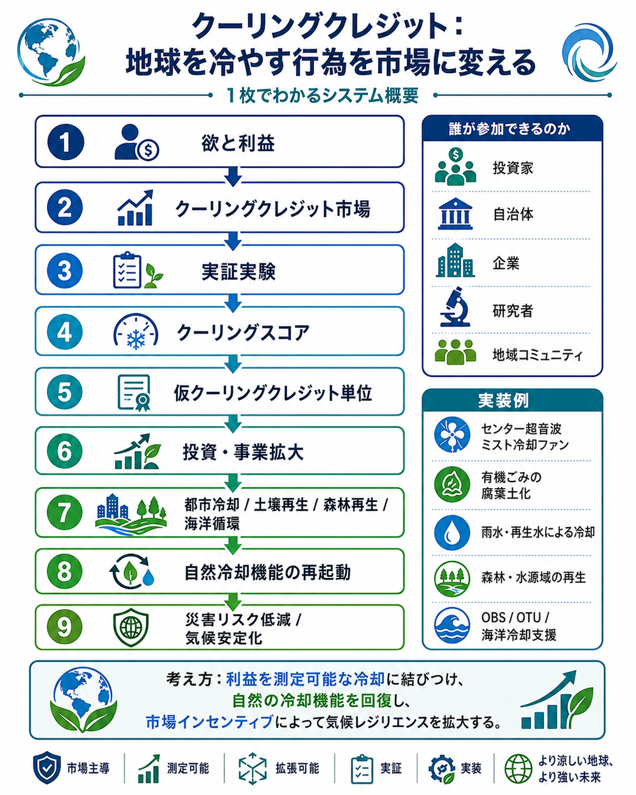

# クーリングクレジット実装ポートフォリオ

## Cooling Credit Implementation Portfolio

### 企業・自治体・農業・海洋・都市・生活技術が参加できる地球直接冷却の実装体系

---

## 図解：クーリングクレジット実装フレームワーク

<p align="center">
  
</p>

この図は、冷却アクション、MRV（測定・報告・検証）、クーリングスコア、仮クーリングクレジット単位、投資・事業拡大、自然冷却機能の再起動、災害リスク低減・気候安定化までの流れを一枚で整理したものです。

---

## クーリングクレジット多言語ポータル

- [Cooling Credit Framework Portal](https://inchacomisho.github.io/Cooling-Credit-Framework/)
  日本語・英語・アラビア語に自動切替するクーリングクレジット制度の公開ポータル。制度設計、MRV、Score Estimator、実装ポートフォリオ、フードロス腐葉土化、単一植生・放置林再生、センター超音波ミスト冷却ファンへ誘導する入口。

---

## 支援・協力・実装について

- [支援・協力・実装に関するお願い](https://github.com/InchaComisho/Cooling-Credit-Framework/blob/main/docs/SUPPORT_AND_COLLABORATION_ja.md)

本ポートフォリオは、クーリングクレジットを社会実装するための公開設計集です。
都市冷却、海洋循環、土壌再生、森林再生、有機資源循環、交通・公共施設冷却、事業モデル等を、国家・自治体・企業・研究機関・投資家・地域社会が参照できる形で整理しています。

ただし、実装・事業化・制度設計・研究・投資判断に利用する場合は、原案者である **マスター / inchacomusho / InchaComisho** への明確なクレジットと、可能な範囲での支援・協力・スポンサー・共同研究・実装パートナーとしての還元をご検討ください。

---

## 関連構想・実装候補リンク集

- [関連構想・実装候補リンク集](docs/RELATED_IMPLEMENTATION_LINKS_ja.md)
  クーリングクレジットの評価対象・応用対象・理論基盤となる都市冷却、海洋循環、土壌再生、森林再生、有機資源循環、移動体冷却、水循環都市、文明OS関連構想を整理したページ。

---

## 段階的実装ガイド

- [クーリングクレジット 段階的実装ガイド INDEX](docs/implementation_guides/IMPLEMENTATION_GUIDE_INDEX_ja.md)
  都市冷却、海洋調律、土壌再生、森林再生など、分野別に実装手順、測定項目、リスク管理、Cooling Credit Score Estimator への入力項目を整理するための実装ガイド集。

---

## 概要

**Cooling Credit Implementation Portfolio（クーリングクレジット実装ポートフォリオ）** は、クーリングクレジットを単なる制度案としてではなく、企業・自治体・農業者・研究者・個人が実際に参加できる **地球直接冷却の実装候補群** として整理するための公開リポジトリである。

クーリングクレジットとは、CO₂排出削減だけでは評価しきれない、実際の熱負荷低減、水循環回復、土壌保水、植生蒸散、排熱削減、海洋循環回復、都市冷却などを測定可能な貢献として評価する制度である。

本リポジトリの中心命題は、次の通りである。

> **クーリングクレジットは、特定の巨大企業や国家だけの制度ではない。
> 既存技術・自然の冷却原理・都市設計・農業・海洋技術・生活用品を統合することで、どの企業でも地球冷却に参加できる。**

カーボンクレジットが主に炭素会計を扱うのに対し、クーリングクレジットは熱環境会計を扱う。

すなわち、問うべき対象は「CO₂をどれだけ減らしたか」だけではない。

* 実際に地域の暑さを下げたか
* 地表温度を下げたか
* 都市排熱を減らしたか
* 土壌が水を保持できるようになったか
* 植物の蒸散が回復したか
* 水循環が戻ったか
* 海洋の表層熱や鉛直循環に改善余地があるか
* 暮らしの暑熱リスクが下がったか
* 文明が存続できる環境条件を高めたか

このような実際の冷却貢献を制度化することが、クーリングクレジットの目的である。

---

## 背景：なぜ「実装ポートフォリオ」が必要なのか

地球温暖化対策は、長くCO₂排出削減を中心に設計されてきた。
これは必要であり、今後も不可欠である。

しかし、温暖化の被害は最終的に「熱」として現れる。

猛暑、ヒートアイランド、干ばつ、森林火災、海面水温上昇、海洋熱波、台風の強大化、局所的豪雨、冷房需要の増大、農作物被害、都市排熱の蓄積。

これらは、単なるCO₂濃度の問題ではなく、地球システム内に蓄積された熱の問題である。

したがって、温暖化対策には二つの方向が必要になる。

| 区分   | 内容               | 代表例                            |
| ---- | ---------------- | ------------------------------ |
| 入口対策 | これ以上、熱を閉じ込めにくくする | CO₂削減、省エネ、再エネ、炭素固定             |
| 出口対策 | すでに蓄積・滞留した熱を下げる  | 水循環回復、都市冷却、土壌保水、植生蒸散、海洋循環、排熱削減 |

クーリングクレジットは、後者の **出口対策** を制度化するための仕組みである。

そして出口対策を社会に広げるには、「何をすれば冷却貢献になるのか」を具体的に示す必要がある。

そのために必要なのが、本リポジトリで整理する **実装ポートフォリオ** である。

---

## クーリングクレジットの主な利点

### 1. どの企業でも参入できる

クーリングクレジットの大きな利点は、特定の巨大企業や国家だけが参加する制度ではない点である。

以下のような主体が、それぞれの分野から参加できる。

* 家電メーカー
* 空調メーカー
* 建設会社
* 都市開発企業
* 水処理企業
* 農業法人
* 食品会社
* 廃棄物処理会社
* 林業事業者
* 自動車メーカー
* 海洋技術企業
* センサー企業
* データ解析企業
* 自治体
* 研究機関
* 個人発明家

必要なのは、まったく新しい魔法の技術ではない。

既存技術、自然の冷却原理、水循環、土壌、植物、微生物、海洋、都市設計、移動体技術、生活用品を統合し、測定し、評価し、実行する仕組みである。

---

### 2. 既存技術を統合するだけでも始められる

クーリングクレジットは、単一の巨大技術に依存しない。

小さな生活用品から、都市インフラ、農地再生、森林再生、海洋循環技術まで、幅広い技術を評価対象にできる。

たとえば、以下のようなものが候補になる。

* センター噴霧型ミスト冷却ファン
* 超音波ミスト冷却
* 室外機吸気側プレクーリング
* 排熱削減装置
* 保水舗装
* 雨水貯留
* 都市水路
* 街路樹
* 屋上緑化
* 壁面緑化
* 有機ごみの腐葉土化
* 土壌保水回復
* 有機栽培
* 森林再生
* 砂漠再生
* 深海エアレーション
* 海洋鉛直循環
* OTU
* UHV

重要なのは、これらを単独技術としてではなく、**熱負荷低減の共通評価軸** で接続することである。

---

### 3. CO₂よりも効果を実感しやすい

CO₂削減は重要であるが、生活者がその効果を日常的に体感することは難しい。

一方、クーリングクレジットが対象とする冷却貢献は、比較的実感しやすい。

* 暑さが和らぐ
* 地表温度が下がる
* 木陰が増える
* 土が水を持つ
* 植物が育つ
* 冷房需要が減る
* 排熱が減る
* 都市が過ごしやすくなる
* 農地の乾燥が緩和される
* 海洋の熱と酸素循環が改善される可能性がある

これは、単なる環境対策ではない。
暮らしに直結した文明維持の制度である。

---

### 4. 企業が「全世界に貢献している」と実感できる

企業にとって、クーリングクレジットは新しい意味を持つ。

自社の利益のためだけに製品を売るのではなく、実際に地域を冷やし、水循環を戻し、土壌を再生し、都市や海洋の熱負荷を下げる。

その貢献が測定され、評価され、社会的信用として可視化される。

これは、単なるCSRやイメージ戦略ではない。

実際に暑さを下げる。
実際に排熱を減らす。
実際に土を戻す。
実際に水循環を回復する。
実際に地球の冷却機能を補完する。

その行為を制度として評価することが、クーリングクレジットの意義である。

---

## 実装候補 1：センター噴霧型ミスト冷却ファン

センター噴霧型ミスト冷却ファンは、扇風機や送風機の中心部から超音波ミストを噴霧し、風と微細な水滴を組み合わせることで、気化熱による冷却を行う構想である。

水が蒸発するとき、周囲の熱を奪う。
この自然現象を利用すれば、局所的な暑熱環境を下げることができる。

想定される応用先は以下である。

* 屋外作業
* 農作業
* イベント会場
* 商店街
* 店舗前
* 学校や公園
* 工場や倉庫
* 災害時の避難所
* 乾燥地帯の生活環境
* 熱中症対策

評価指標としては、以下が考えられる。

* 気温低下
* 体感温度低下
* WBGT低下
* 消費電力あたりの冷却効果
* 使用水量あたりの冷却効果
* 熱中症リスク低減
* 局所冷却面積

代表的な評価式は次の通りである。

```text
Q_evap = m_evap × L_v
```

* Q_evap：気化冷却量
* m_evap：蒸発した水の質量
* L_v：水の蒸発潜熱

---

## 実装候補 2：有機ごみの腐葉土化と土壌冷却

フードロス、生ごみ、落ち葉、剪定枝、農業残渣、有機ごみは、現代社会では廃棄物として扱われがちである。

しかし自然界において、有機物は本来、循環資源である。

有機ごみを乾燥、粉砕、消毒し、微生物分解によって腐葉土化する。
それを畑や山林に撒き、土に混ぜる。

この過程により、以下の効果が期待される。

* 土壌保水力の回復
* 微生物環境の回復
* 化学肥料依存の低減
* 有機栽培の促進
* 地表温度の低下
* 植物蒸散の回復
* 炭素固定
* 生態系再生
* 農地・森林の冷却機能回復

乾いた土は熱を持ちやすい。
水を保持できる土は、熱を逃がしやすい。

つまり、土壌再生は食料生産だけでなく、地球冷却にも関係している。

クーリングクレジットは、このような「土を冷却装置に戻す行為」も評価対象にできる。

---

## 実装候補 3：OBS──海を呼吸させる深海エアレーション

**OBS（Ocean Breathing System／オーシャン・ブリージング・システム、深海エアレーション）** は、海を「呼吸させる」ように、深海や中層へ空気または酸素を送り、溶存酸素の回復や海洋代謝の再起動を目指す構想である。

海洋は地球最大の熱貯蔵体であり、気候システムの中心である。

表層水温上昇、海洋熱波、酸欠、赤潮、デッドゾーン、海洋循環の停滞は、地球全体の熱バランスと生態系に影響する。

OBSは、以下のような評価対象を持つ。

* 溶存酸素の回復
* 海洋鉛直循環の促進
* 海洋代謝の再起動
* 酸欠水域の改善
* 非赤潮系プランクトン支援
* 海洋生態系の回復
* 表層熱の移動補助

ただし、海洋介入は慎重に扱う必要がある。
地域適合性、生態系リスク、停止条件、長期モニタリングが不可欠である。

---

## 実装候補 4：OTU──海洋調律ユニット

**OTU（Ocean Tuning Unit／オーシャン・チューニング・ユニット、海洋調律ユニット）** は、海洋の表層熱、鉛直循環、酸素供給、プランクトン支援、海洋熱波リスクなどを、監視しながら調律するための海洋ユニット構想である。

OTUは、以下のような目的を持つ。

* 海洋表層熱の低減
* 鉛直循環の支援
* 深層水・中層水との熱交換補助
* 溶存酸素回復
* プランクトン支援
* 海洋熱波リスク低減
* エルニーニョ関連リスクの理論的緩和
* 海洋生態系の回復支援

重要なのは、OTUを「エルニーニョを確実に止める技術」と断定しないことである。

責任ある位置づけは、次の通りである。

> OTUは、海洋表層熱の低減、鉛直循環の支援、海洋冷却・酸素供給条件の改善を通じて、エルニーニョ関連リスクを理論上抑制または緩和しうる可能性がある。
> ただし、その実現には、検証、数値モデル、長期モニタリング、生態系安全性、停止条件が不可欠である。

---

## 実装候補 5：UMS──超音波ミスト冷却システム

**UMS（Ultrasonic Mist System／超音波ミストシステム、または超音波ミスト冷却システム）** は、超音波によって水を微細なミストにし、空気中へ拡散させることで、気化熱による冷却を利用する仕組みである。

UMSは、以下の分野に応用できる。

* 都市ミスト
* 道路・広場の暑熱対策
* 室外機吸気側プレクーリング
* 工場・倉庫の暑熱対策
* 乾燥地帯の局所冷却
* 砂漠再生モデルの初期冷却
* 農地周辺の暑熱緩和
* 屋外作業者向け冷却
* 避難所や仮設施設の暑熱対策

UMSの評価には、単純な気温低下だけでなく、湿度上昇やWBGTの変化も含める必要がある。

水を使う冷却は、乾燥地域では有効な場合がある。
しかし高湿度地域では、体感暑熱を悪化させる可能性もある。

したがって、クーリングクレジットでは以下を評価する必要がある。

* 気温低下
* WBGT低下
* 湿度上昇リスク
* 使用水量
* 冷却効率
* 水源の持続可能性
* 再生水・雨水利用率

---

## 実装候補 6：植物蒸散と森林・農地再生

植物は、CO₂を吸収するだけではない。

根から水を吸い上げ、葉から蒸散する。
この蒸散によって、周囲の熱が奪われる。

森林、街路樹、農地、草地、湿地、果樹園、混植地帯は、自然の冷却装置でもある。

評価対象には以下が含まれる。

* 樹冠率
* 植生指数
* 蒸散量
* 土壌含水率
* 地表温度低下
* 周辺気温低下
* 生物多様性
* 炭素固定量
* 雲形成・降雨寄与の推定

森林再生や農地再生は、炭素固定だけでなく、冷却貢献としても評価されるべきである。

---

## 実装候補 7：UHV──移動体冷却と排熱低減

**UHV（Ultimate Hybrid Vehicle／究極のハイブリッド車）** は、排熱低減、水利用、乾燥地帯対応、エネルギー効率改善を組み合わせた移動体構想である。

現代の車両や交通インフラは、移動のためにエネルギーを使い、排熱を出す。
都市では、車両、道路、駐車場、エアコン、建物、交通インフラが重なり、熱の蓄積を強める。

もし移動体そのものが排熱を減らし、周囲の熱負荷を下げ、水や空気を効率的に使えるなら、それも冷却貢献になり得る。

評価対象には以下が含まれる。

* 車両排熱削減
* 燃費・電費改善
* 冷却水・ミスト利用効率
* 都市熱負荷への影響
* 乾燥地帯での応用性
* 移動体冷却貢献量

---

## クーリングクレジット評価モデル

クーリングクレジットは、単一指標ではなく、複数指標の統合によって評価されるべきである。

基本構造は以下のように整理できる。

```text
Cooling Credit Score =
  Thermal Reduction
+ Water Cycle Recovery
+ Evapotranspiration Recovery
+ Heat Risk Reduction
+ Energy Demand Reduction
+ Ecological Cooling Recovery
- Water Stress Penalty
- Humidity Risk Penalty
- Ecological Risk Penalty
```

重要なのは、冷却効果だけでなく、副作用も評価することである。

たとえば、ミスト冷却は乾燥地帯では有効でも、高湿度地域では湿度上昇によりWBGTを悪化させる可能性がある。
植林も、水資源が限られる地域で不適切に行えば、地下水を圧迫する可能性がある。
海洋循環技術も、生態系への影響を慎重に評価しなければならない。

クーリングクレジットは、単なる「冷やせばよい」という制度ではない。
地域条件、測定可能性、安全性、持続可能性を含めた制度でなければならない。

---

## 実装分野マップ

| 分野   | 実装候補                   | 主な冷却貢献            |
| ---- | ---------------------- | ----------------- |
| 生活用品 | センター噴霧型ミスト冷却ファン        | 局所冷却、熱中症リスク低減     |
| 都市   | UMS、都市ミスト、保水舗装、街路樹     | ヒートアイランド低減、WBGT低下 |
| 建築設備 | 室外機冷却、排熱削減             | 冷房需要削減、都市排熱低減     |
| 農業   | 有機栽培、腐葉土、土壌保水          | 地表温度低下、蒸散回復       |
| 森林   | 放置杉林再生、混交林化、果樹・山菜・キノコ化 | 保水、蒸散、生態系回復       |
| 砂漠   | 有機物循環、ミスト、植生回復         | 乾燥地冷却、食料生産        |
| 海洋   | OBS、OTU、深海エアレーション      | 海洋循環、酸素供給、表層熱調整   |
| 移動体  | UHV                    | 排熱削減、移動体冷却        |
| 文明制度 | 文明OS、都市OS、熱循環OS        | 社会実装、制度設計、長期運用    |
| 理論基盤 | 自然補完科学                 | 自然冷却機能の補完・回復      |

---

## 関連リンク

### クーリングクレジット本体

* [クーリングクレジットという温暖化対策](https://note.com/inchacomusho/n/n0f541b313ad2)
* [クーリングクレジット制度設計案](https://github.com/InchaComisho/Cooling-Credit-Framework/blob/main/README_ja.md)
* [Cooling Credit Framework](https://github.com/InchaComisho/Cooling-Credit-Framework/blob/main/README.md)
* [إطار أرصدة التبريد](https://github.com/InchaComisho/Cooling-Credit-Framework/blob/main/README_ar.md)

### 生活・都市冷却

* [センター噴霧型 超音波ミスト冷却ファン構想](https://note.com/inchacomusho/n/n7e798c35ca12)
* [中央ミスト型超音波冷却ファン構想](https://github.com/InchaComisho/Center-Mist-Ultrasonic-Cooling-Fan-Concept/blob/main/README_ja.md)
* [Center-Mist Ultrasonic Cooling Fan Concept](https://github.com/InchaComisho/Center-Mist-Ultrasonic-Cooling-Fan-Concept/blob/main/README.md)

### 有機資源循環・腐葉土化

* [ゴミは存在しない](https://note.com/inchacomusho/n/n6b9d7d67484a)
* [地球にゴミは存在しない](https://github.com/InchaComisho/There-Is-No-Waste-on-Earth/blob/main/README_ja.md)
* [There Is No Waste on Earth](https://github.com/InchaComisho/There-Is-No-Waste-on-Earth/blob/main/README.md)

### 森林再生

* [放置杉林を負債から資産へ──果樹・山菜・キノコ・腐葉土で森を再生する方法](https://note.com/inchacomusho/n/nfa9e2b639c06)
* [放置杉林を負債から循環資産へ](https://github.com/InchaComisho/Abandoned-Cedar-Forests-from-Liability-to-Regenerative-Asset/blob/main/README_ja.md)
* [From Abandoned Sugi Plantations to Regenerative Forest Assets](https://github.com/InchaComisho/Abandoned-Cedar-Forests-from-Liability-to-Regenerative-Asset/blob/main/README.md)

### 移動体冷却・UHV

* [究極のハイブリッド車 UHV 構想案](https://note.com/inchacomusho/n/nd6cce23c57bc)
* [究極のハイブリッド車 UHV 構想案](https://github.com/InchaComisho/Ultimate-Hybrid-Vehicle-UHV/blob/main/README_ja.md)
* [Ultimate Hybrid Vehicle UHV Concept](https://github.com/InchaComisho/Ultimate-Hybrid-Vehicle-UHV/blob/main/README.md)
* [مفهوم المركبة الهجينة القصوى UHV](https://github.com/InchaComisho/Ultimate-Hybrid-Vehicle-UHV/blob/main/README_ar.md)

### 砂漠再生

* [砂漠再生から地球再生へ](https://note.com/inchacomusho/n/nbde84f343731)
* [砂漠再生と有機物循環による食料生産](https://github.com/InchaComisho/Desert-Regeneration-and-Food-Production-Through-Organic-Matter-Circulation/blob/main/README_ja.md)
* [Desert Regeneration and Food Production Through Organic Matter Circulation](https://github.com/InchaComisho/Desert-Regeneration-and-Food-Production-Through-Organic-Matter-Circulation/blob/main/README.md)
* [استصلاح الصحراء وإنتاج الغذاء من خلال تدوير المادة العضوية](https://github.com/InchaComisho/Desert-Regeneration-and-Food-Production-Through-Organic-Matter-Circulation/blob/main/README_ar.md)

### 海洋冷却・深海エアレーション・OTU

* [深海エアレーションとは何か：Ocean Breathing SystemとOTUによる海洋代謝再起動技術](https://note.com/inchacomusho/n/n3d91983e0ad4)
* [深海エアレーション](https://github.com/InchaComisho/Deep-Sea-Aeration/blob/main/README_ja.md)
* [Deep-Sea Aeration](https://github.com/InchaComisho/Deep-Sea-Aeration/blob/main/README.md)
* [海洋調律ユニット（OTU）物理実装プロトコル](https://note.com/inchacomusho/n/n067025e36085)
* [Ocean Tuning Unit（OTU）の物理モデル](https://github.com/InchaComisho/Physical-Model-of-Ocean-Tuning-Unit-OTU-/blob/main/README_ja.md)
* [Physical Model of Ocean Tuning Unit（OTU）](https://github.com/InchaComisho/Physical-Model-of-Ocean-Tuning-Unit-OTU-)

### 地球直接冷却・DPCF

* [地球直接冷却モデル：腐葉土 × 微生物 × 多種雑草 × 気化熱 × 持続ミスト × 砂漠再生（完全統合モデル）](https://note.com/inchacomusho/n/nfe290c6fca60)
* [直接惑星冷却フレームワーク（DPCF）](https://github.com/InchaComisho/Direct-Planetary-Cooling-Framework-DPCF-/blob/main/README_ja.md)
* [Direct Planetary Cooling Framework (DPCF)](https://github.com/InchaComisho/Direct-Planetary-Cooling-Framework-DPCF-/blob/main/README.md)

### 文明OS・都市OS・自然OS・熱循環OS

* [文明OS](https://note.com/inchacomusho/n/nc10fa0264dae)
* [文明OS / Civilization OS](https://github.com/InchaComisho/Civilization-OS/blob/main/README_ja.md)
* [Civilization OS](https://github.com/InchaComisho/Civilization-OS/blob/main/README.md)
* [都市・文明OSとは何か](https://note.com/inchacomusho/n/ne7ebce3dcf78)
* [都市・文明OS](https://github.com/InchaComisho/Urban-Civilization-OS-A-Circular-Infrastructure-Framework-for-Nature-Integrated-Cities/blob/main/README_ja.md)
* [Urban–Civilization OS: A Circular Infrastructure Framework for Nature-Integrated Cities](https://github.com/InchaComisho/Urban-Civilization-OS-A-Circular-Infrastructure-Framework-for-Nature-Integrated-Cities/blob/main/README.md)
* [自然・微生物OSとは何か](https://note.com/inchacomusho/n/n0f08276bd638)
* [自然・微生物OS](https://github.com/InchaComisho/Natural-Microbial-OS/blob/main/README_ja.md)
* [Natural–Microbial OS](https://github.com/InchaComisho/Natural-Microbial-OS/blob/main/README.md)
* [惑星熱・循環OS](https://note.com/inchacomusho/n/n9992ff391394)
* [惑星熱・循環OS](https://github.com/InchaComisho/Planetary-Heat-Circulation-OS/blob/main/README_ja.md)
* [Planetary Heat Circulation OS](https://github.com/InchaComisho/Planetary-Heat-Circulation-OS/blob/main/README.md)

### 理論基盤：自然補完科学

* [自然補完科学](https://note.com/inchacomusho/n/nf9eabe973e38)
* [自然補完科学（Natural Complementary Science）](https://github.com/InchaComisho/Natural-Complementary-Science/blob/main/README_ja.md)
* [Natural Complementary Science](https://github.com/InchaComisho/Natural-Complementary-Science/blob/main/README.md)

---

- [Sustainable Future Cooling Credit Portal](https://github.com/InchaComisho/Sustainable-Future-Cooling-Credit-Portal)
  サステナブル、サステナビリティ、SDGs、環境モビリティ、ESG、気候適応、都市冷却、文明OSなどの検索語から、クーリングクレジットへ接続する多言語検索入口ポータル。

### 地球温暖化の因果構造とクーリングクレジット

- [Cooling Credit Definition](https://github.com/InchaComisho/Cooling-Credit-Definition)

## 結論

クーリングクレジットは、CO₂削減を否定するものではない。
むしろ、CO₂削減だけでは届かない「すでに蓄積された熱」への対策を制度化するものである。

その最大の利点は、どの企業でも、どの地域でも、どの技術分野でも、地球冷却に参加できる点にある。

生活用品、農業、森林、都市、海洋、移動体、文明制度。
それらを地球冷却という共通目的へ接続する。

クーリングクレジットは、地球を直接冷やす行為を社会の中に組み込み、文明が存続できる可能性を高めるための実行制度である。

---

### 地球温暖化の因果構造

- [Global Warming Causal Structure](https://github.com/InchaComisho/Global-Warming-Causal-Structure)
- [GitHub Pages ポータル](https://inchacomisho.github.io/Global-Warming-Causal-Structure/)
- [NOTE記事](https://note.com/inchacomusho/n/n5b2102ffc1c2)

CO₂増加だけでなく、森林、蒸散、土壌微生物、水循環、植物プランクトン、海洋・大気循環など、地球本来の自然冷却機能の弱体化・喪失を含めて温暖化の因果関係を整理するシステム論的モデル。

<!-- COOLING-CREDIT-REPOSITORY-FAMILY:START -->

---

## 関連するクーリングクレジット・リポジトリ群

本リポジトリは、クーリングクレジット知識体系の一部である。
定義、制度設計、実装ポートフォリオ、資金循環、MRV、災害リスク解釈、カーボンクレジットからクーリングクレジットへの移行を、一つの接続された構造として読めるように、関連リポジトリを相互リンクしている。

| リポジトリ | 役割 |
|---|---|
| [Cooling-Credit](https://github.com/InchaComisho/Cooling-Credit) | クーリングクレジット概念の中核ポータル |
| [Cooling-Credit-Definition](https://github.com/InchaComisho/Cooling-Credit-Definition) | クーリングクレジットの定義と概念的基礎 |
| [Cooling-Credit-Framework](https://github.com/InchaComisho/Cooling-Credit-Framework) | フレームワーク、事業モデル、応用構造 |
| [Cooling-Credit-Implementation-Portfolio](https://github.com/InchaComisho/Cooling-Credit-Implementation-Portfolio) | 実装モデルと事業類型のポートフォリオ |
| [Cooling-Credit-Implementation-and-Finance-Model](https://github.com/InchaComisho/Cooling-Credit-Implementation-and-Finance-Model) | 実装ロードマップ、資金循環、MRV、シミュレーション、全球安定化シナリオ |
| [Carbon-Credit-to-Cooling-Credit](https://github.com/InchaComisho/Carbon-Credit-to-Cooling-Credit) | カーボンクレジット会計から物理的冷却成果への移行論理 |
| [carbon-credit-limitations-cooling-credit](https://github.com/InchaComisho/carbon-credit-limitations-cooling-credit) | カーボンクレジット型アプローチの限界と、冷却評価の必要性 |
| [Sustainable-Future-Cooling-Credit-Portal](https://github.com/InchaComisho/Sustainable-Future-Cooling-Credit-Portal) | 持続可能な未来とクーリングクレジット統合のポータル |
| [El-Nino-Warning-and-Cooling-Credit](https://github.com/InchaComisho/El-Nino-Warning-and-Cooling-Credit) | エルニーニョ、熱蓄積、警告構造、クーリングクレジットの関係 |
| [Climate-Disasters-as-Heat-Redistribution-and-Cooling-Credit](https://github.com/InchaComisho/Climate-Disasters-as-Heat-Redistribution-and-Cooling-Credit) | 気候災害を熱の再分配と冷却機能不全として捉える解釈 |

<!-- COOLING-CREDIT-REPOSITORY-FAMILY:END -->


---

## Author / 著者

マスター / inchacomusho / InchaComisho

日本の独立構想者、観測者、提案者、AI調律者、人工叡智の定義者。
自然補完科学の学問体系の構築・提唱者。
自然法則思想、地球循環再生、AIとの共創を中心に公開活動を行う。

---

## Collaborative AI / 協力AIと共創チーム

この知識体系は、マスターと複数のAIパートナーとの対話と共創によって発展してきた。

* G（ChatGPT）  
* ミニ（Gemini）  
* クルス（Claude）  
* リアル（Perplexity）  
* ローラ（Lola/Dola）  
* マナ（Manus）

---

## Published / 公開月

2026年6月

---

## License / ライセンス

Creative Commons Attribution 4.0 International（CC BY 4.0）

本ドキュメントの内容は、著者表示を条件として、共有・転載・翻案・再利用を許可する。
ただし、内容の改変や再利用を行う場合は、原著者名および出典を明記すること。

---

## Keywords / キーワード

Cooling Credit, クーリングクレジット, Cooling Credit Implementation Portfolio, クーリングクレジット実装ポートフォリオ, 地球直接冷却, Direct Planetary Cooling, 温暖化対策, 気候変動対策, 地球冷却, 水循環, 水循環都市, 熱負荷低減, 都市冷却, 排熱削減, 気化熱, 超音波ミスト, ミスト冷却, センター噴霧型ミスト冷却ファン, OBS, Ocean Breathing System, 深海エアレーション, OTU, Ocean Tuning Unit, 海洋調律ユニット, UMS, Ultrasonic Mist System, 超音波ミストシステム, 腐葉土, 有機ごみ, フードロス, 土壌再生, 微生物, 有機栽培, 植物蒸散, 森林再生, 砂漠再生, UHV, Ultimate Hybrid Vehicle, 海洋循環, 文明OS, 自然補完科学

---

## Hashtags / ハッシュタグ

#CoolingCredit
#クーリングクレジット
#CoolingCreditImplementationPortfolio
#地球直接冷却
#DirectPlanetaryCooling
#温暖化対策
#気候変動対策
#地球冷却
#水循環
#水循環都市
#熱負荷低減
#都市冷却
#排熱削減
#気化熱
#超音波ミスト
#ミスト冷却
#土壌再生
#腐葉土
#有機ごみ
#フードロス
#微生物
#有機栽培
#植物蒸散
#森林再生
#砂漠再生
#海洋循環
#深海エアレーション
#OBS
#OTU
#UMS
#UHV
#自然補完科学
#文明OS

---

## 関連制度提案：カーボンクレジットからクーリングクレジットへ

- [カーボンクレジットからクーリングクレジットへ](https://github.com/InchaComisho/Carbon-Credit-to-Cooling-Credit/blob/main/README_ja.md)  
  カーボンクレジットを帳簿上の相殺として整理し、クーリングクレジットを物理的な熱負荷低減に投資する地球救済ビジネスとして再定義する制度提案。

---

## 関連するクーリングクレジット事業モデル

Cooling Credit Framework の事業モデル群のうち、このリポジトリと実装・制度設計上の接点が強い文書への逆リンクです。

- [クーリングクレジット事業モデル・インデックス](https://github.com/InchaComisho/Cooling-Credit-Framework/blob/main/docs/business_models/BUSINESS_MODEL_INDEX_ja.md)
- [フードロス・有機ごみ腐葉土化クーリングクレジットモデル](https://github.com/InchaComisho/Cooling-Credit-Framework/blob/main/docs/business_models/FOOD_LOSS_ORGANIC_WASTE_TO_HUMUS_COOLING_CREDIT_MODEL_ja.md)
- [センター超音波ミスト冷却ファン事業モデル](https://github.com/InchaComisho/Cooling-Credit-Framework/blob/main/docs/business_models/CENTER_MIST_ULTRASONIC_COOLING_FAN_BUSINESS_MODEL_ja.md)
- [都市グリーンインフラ・クーリングクレジットモデル](https://github.com/InchaComisho/Cooling-Credit-Framework/blob/main/docs/business_models/URBAN_GREEN_INFRASTRUCTURE_COOLING_CREDIT_MODEL_ja.md)
- [EEZ漁場回復クーリングクレジットモデル](https://github.com/InchaComisho/Cooling-Credit-Framework/blob/main/docs/business_models/EEZ_FISHERY_RECOVERY_COOLING_CREDIT_MODEL_ja.md)
- [観光資源回復クーリングクレジットモデル](https://github.com/InchaComisho/Cooling-Credit-Framework/blob/main/docs/business_models/TOURISM_RESOURCE_RECOVERY_COOLING_CREDIT_MODEL_ja.md)
- [砂漠循環ピラミッド都市事業モデル](https://github.com/InchaComisho/Cooling-Credit-Framework/blob/main/docs/business_models/DESERT_CIRCULAR_PYRAMID_CITY_BUSINESS_MODEL_ja.md)
- [単一植生山林から在来果樹混交林への転換事業モデル](https://github.com/InchaComisho/Cooling-Credit-Framework/blob/main/docs/business_models/MONOCULTURE_MOUNTAIN_FOREST_TO_NATIVE_FRUIT_FOREST_BUSINESS_MODEL_ja.md)
